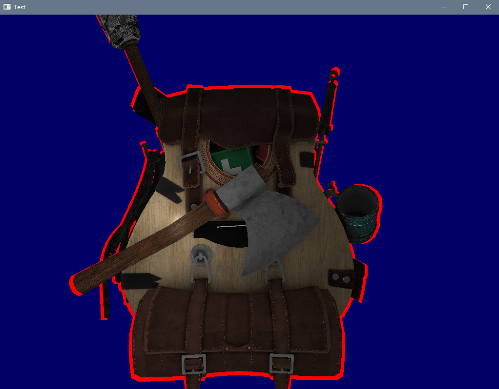
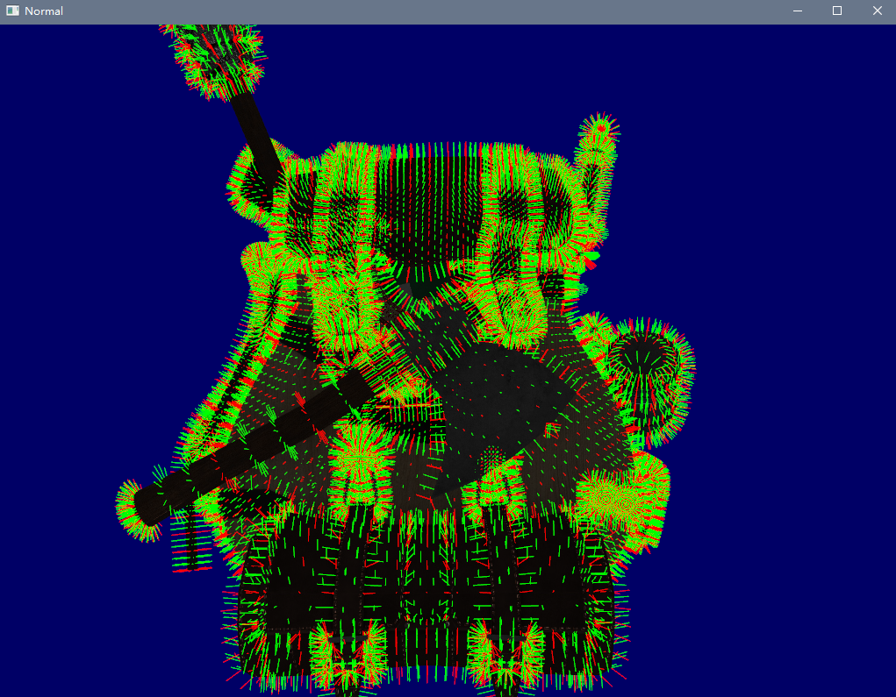
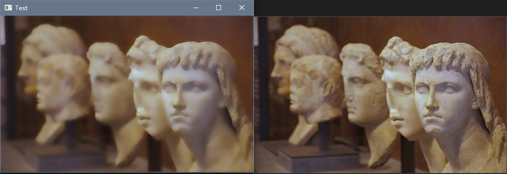
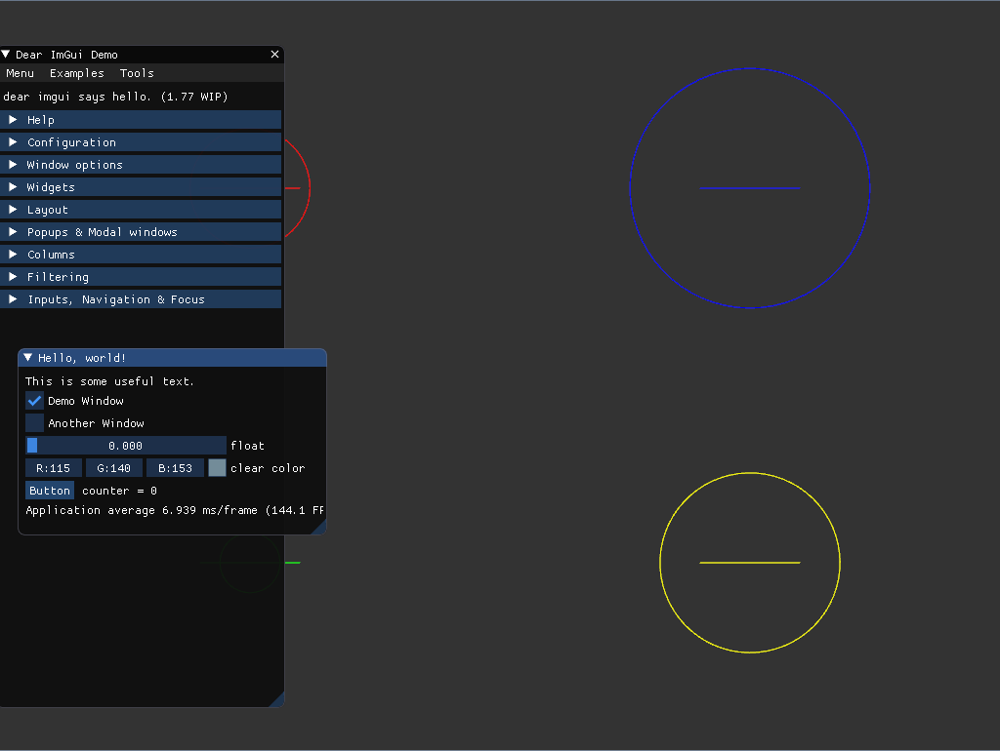

# OpenGL Template

English | [中文](README-CN.md)

[](https://travis-ci.com/Biobots/GL-Template)   

A simple OpenGL application template aiming at reducing the procedures of varied configurations on different platforms with the help of CMake. Some OpenGL functions are also packaged for reference(Under development). An additional function is also provided to embed resource files such as images, shaders into a single executable file.

Examples can be found in `./example`.

## Build

### Windows(Mingw)

```powershell
git submodule update --init
mkdir build
cd build
cmake .. -G "MinGW Makefiles"
make
```

### Windows(Visual Studio 2017 or higher)

1. `Files`->`Open`->`CMake`, choose CMakeLists.txt in the root directory of this project.

2. `CMake`->`Generate all`

### Linux

```bash
git submodule update --init
mkdir build
cd build
cmake ..
make
```

### OSX

```bash
git submodule update --init
mkdir build
cd build
cmake ..
make
```


## 3rd-party libraries

1. [assimp](https://github.com/assimp/assimp): The official Open-Asset-Importer-Library Repository.

2. [bin2c](https://github.com/gwilymk/bin2c): A very simple utility for converting a binary file to a c source file.

3. [glew-cmake](https://github.com/Perlmint/glew-cmake): GLEW is a cross-platform open-source C/C++ extension loading library.

4. [glfw](https://github.com/glfw/glfw): A multi-platform library for OpenGL, OpenGL ES, Vulkan, window and input.

5. [glm](https://github.com/g-truc/glm): GLM is a header only C++ mathematics library for graphics software based on the OpenGL Shading Language (GLSL) specifications.

6. [imgui](https://github.com/ocornut/imgui): ImGui is a bloat-free graphical user interface library for C++.

7. [mango](https://github.com/t0rakka/mango): A multi-platform low-level development framework for graphics programmers.

## Related Documents

1. [Quaternion proof](http://graphics.stanford.edu/courses/cs348a-17-winter/Papers/quaternion.pdf)

2. [What are the different texture maps for](https://help.poliigon.com/en/articles/1712652-what-are-the-different-texture-maps-for)

## Screenshots








